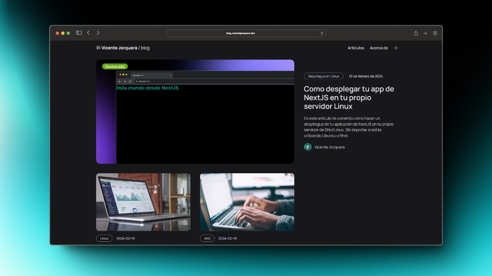

# Blog de Vicente Jorquera

Este es un proyecto personal desarrollado con la intención de compartir mis conocimientos y experiencias en IT con la comunidad. Sin embargo, no espero crear los mismos artículos o tutoriales que crean en todos lados, más bien, mis artículos son respuestas a preguntas que me he realizado en algún momento de mi carrera.

## Tecnologías utilizadas

Estas son algunas de las tecnologías que he utilizado para llevar a cabo el desarrollo de mi blog.

- **Astro:** a modo de poner en práctica mis conocimientos en otros frameworks que no fueran NextJS (lo que más utilizo en proyectos) me encontré con Astro, una excelente opción para desarrollar webs estáticas y con un increíble rendimiento debido a que envía prácticamente nada de JS al cliente al aprovechar el SSR principalmente.

- **Vercel:** como ya es costumbre para mi, utilizo Vercel como servicio de hosting debido a que es gratuito para proyectos personales y de hobby.

- **Cloudflare:** gestor de dominios, subdominios y DNS. Es es el servicio al que le confio la gestión de mi dominio personal [vicentejorquera.dev](https://www.vicentejorquera.dev/)

- **Amazon S3:** tras estar aprendiendo la ruta de Cloud Partitioner de AWS, uno de los servicios gratuitos para siempre que parecio útil para almacenar mis imágenes es Amazon S3 (Amazon Simple Storage Service) permite agregar buckets infinitos y cuentas con 5gb de espacio gratuito además de una cuota de transferencia bastante generosa (expandible a través de un pago por uso de la misma).

## Enlaces relacionados

- **Enlace al blog:** [https://blog.vicentejorquera.dev/](https://blog.vicentejorquera.dev)

- **Enlace a mi web:** [https://www.vicentejorquera.dev/](https://www.vicentejorquera.dev)

- **Mi LinkedIn:** [https://www.linkedin.com/in/vicentejorquera](https://www.linkedin.com/in/vicentejorquera)

- **Instagram:** [https://www.instagram.com/jvicente_20](https://www.instagram.com/jvicente_20)